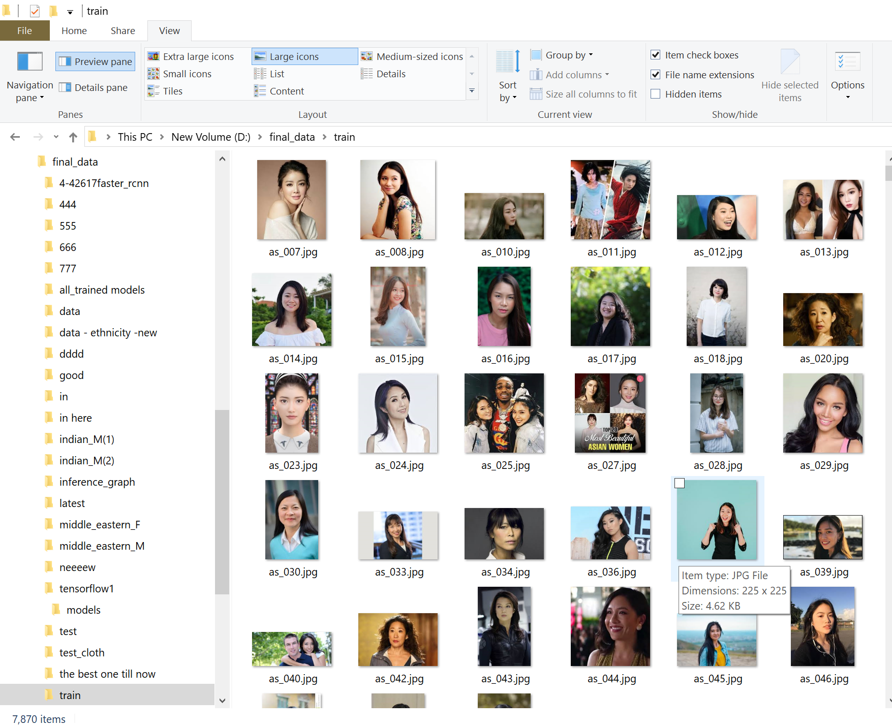
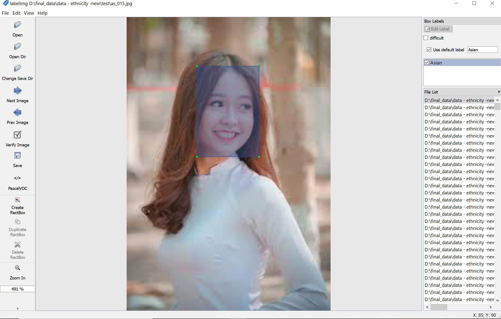
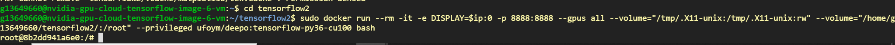
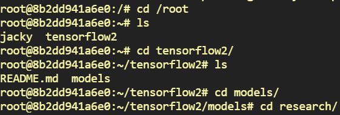
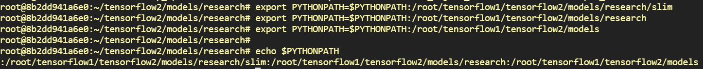
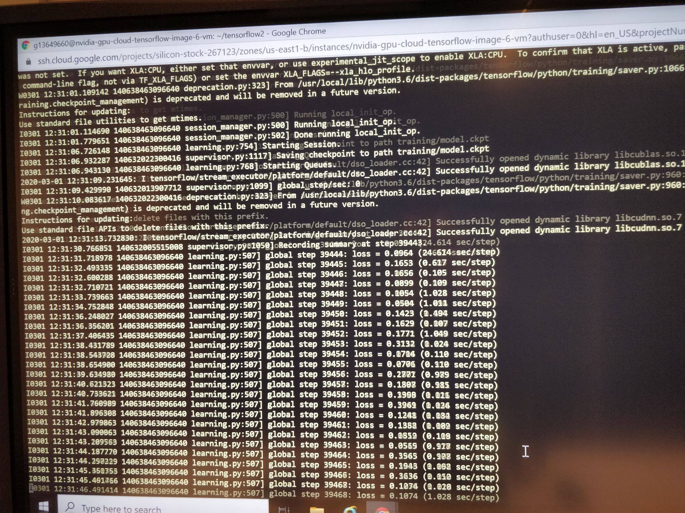

## Dataset

I did not directly use the existing data set on ethnic classification on the Internet, I creat my own dataset from Google. There are 10 different classifications, each of which contains 400 pictures.
Buy the way, I found a easy way to download images from Google by an [extensions](https://chrome.google.com/webstore/detail/fatkun-batch-download-ima/nnjjahlikiabnchcpehcpkdeckfgnohf?hl=en). It helped me to download hundred of images within 5 minutes so I haven't sepend too mush time on creating dataset.

 

## Label
I used a tool called "[labellmg-Window_1.8.0](https://www.dropbox.com/s/kqoxr10l3rkstqd/windows_v1.8.0.zip?dl=1)". You can find linux verion or other windows version [here](https://tzutalin.github.io/labelImg/), but I have not found mac version.
Labeling is a time-consuming task, because you need to be vigilant about which label the picture belongs to.

 

## Preparation
I trained my model with [object detection API](https://github.com/tensorflow/models/tree/master/research/object_detection) and I used anaconda to creat a virtual environment on my laptop.
I follow an [tutorial](https://github.com/EdjeElectronics/TensorFlow-Object-Detection-API-Tutorial-Train-Multiple-Objects-Windows-10/blob/master/README.md) to set up everything on Windows 10. I have already set up everything and uploaded it to my [repository](https://gitlab.com/ZeyuLi123/tensorflow2).

## feedback.txt

`feedback.txt` contains some necessary libraries and codes for training our own model(Ethnicity and cloth) 

I will show you how do I train my model in Goodle Cloud step by step

Firstly, you should follow [this link](https://gitlab.com/summer-studio-neural-networks/summerstudio2020/-/blob/master/Gcloud/Google%20Cloud%20general%20setup%20instructions.pdf) link to creat a new comput VM.

After creating VM instances successfully, you could open your VM engine through SSH and clone your repository.


The code below are used for creat a virtual environment for this project. I changed first part of the volume to my own path in VM.

```bash
sudo docker run --rm -it -e DISPLAY=$ip:0 -p 8888:8888 --gpus all --volume="/tmp/.X11-unix:/tmp/.X11-unix:rw" --volume="/home/g13649660/tensorflow2/:/root" --privileged ufoym/deepo:tensorflow-py36-cu100 bash
```


In ubuntu system, I used `cd` and `ls` command to navigate specific path.



These pip command can be used in Google cloud directly and it help me to install necessary python libraries. 
```bash
pip install --user Cython
pip install --user contextlib2
pip install --user pillow
pip install --user lxml
pip install --user jupyter
pip install --user matplotlib
```
When running the code, the directories below should be appended to PYTHONPATH. This can be done by running the following from tensorflow/models/research/:
```bash
export PYTHONPATH=$PYTHONPATH:/root/tensorflow1/tensorflow2/models/research/slim
export PYTHONPATH=$PYTHONPATH:/root/tensorflow1/tensorflow2/models/research
export PYTHONPATH=$PYTHONPATH:/root/tensorflow1/tensorflow2/models
```
I used "echo $PYTHONPATH" to check if I have set it successfully.



Download and install the 3.0 release of protoc, then unzip the file.

```bash
# From tensorflow/models/research/
wget -O protobuf.zip https://github.com/google/protobuf/releases/download/v3.0.0/protoc-3.0.0-linux-x86_64.zip
unzip protobuf.zip
```
Run the compilation process again, but use the downloaded version of protoc

```bash
# From tensorflow/models/research/
./bin/protoc object_detection/protos/*.proto --python_out=.
```
Finally, run the following commands from the ~/tensorflow1/models/research directory:

```bash
python setup.py build
python setup.py install
```
I chose the pre-trained model "faster_rcnn_inception_v2_coco", so the script below are used to start my training.

```bash
python train.py --logtostderr --train_dir=training/ --pipeline_config_path=training/faster_rcnn_inception_v2_coco.config
```


**Now, you can start to train your own models!~**